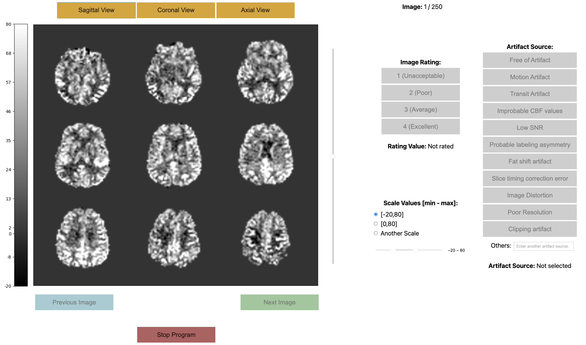

# ASL CBF Rating Tool


Xavier Beltran Urbano,  Sudipto Dolui and John A Detre


## Instructions
This tool is designed to be user-friendly and intuitive. To get started, simply clone the repository and install any required dependencies as listed in the `requirements.txt` file. You can initiate the tool by executing the main script from the command line. Here’s a step-by-step guide to ensure you have a smooth experience:

1. **Initial Setup**:
   - Install the necessary dependencies using the command:
     ```
     pip install -r requirements.txt
     ```
2. **Running the Tool**:
   - To run the tool, you need to first upload the notebook on Google Colab. 
   - After that, select _Runtime - Run All_. This will run the notebook.
3. **Using the Tool**:
   - Follow the on-screen prompts to make selections. The tool is interactive and will guide you through the necessary steps to complete your tasks.
4. **Saving and Exiting**:
   - The tool automatically saves your progress. To exit, simply follow the prompts to close the application properly.
5. **Getting Help**:
      - If you encounter any issues or require further assistance, contact the support team via email: [xavier.urbano@pennmedicine.upenn.edu](mailto:xavier.urbano@pennmedicine.upenn.edu)

## Example
An example of how the tool looks like is showed in Figure 1.
<p align="center">
  
  <br>
  <em> Fig.1.Example of the ASL CBF rating tool.</em>
</p>